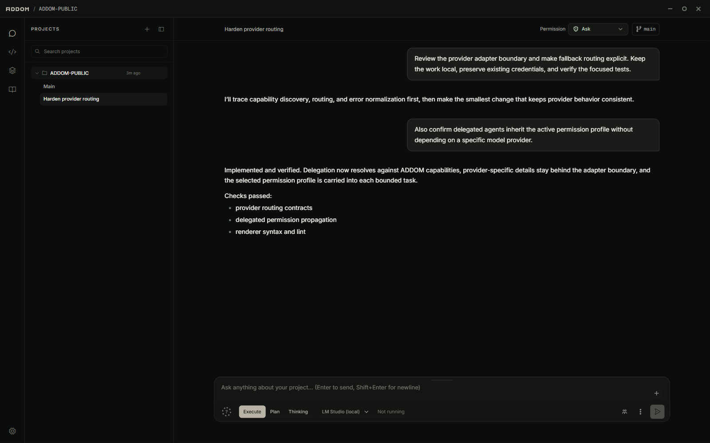
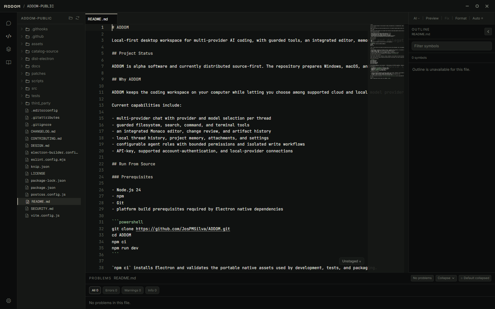
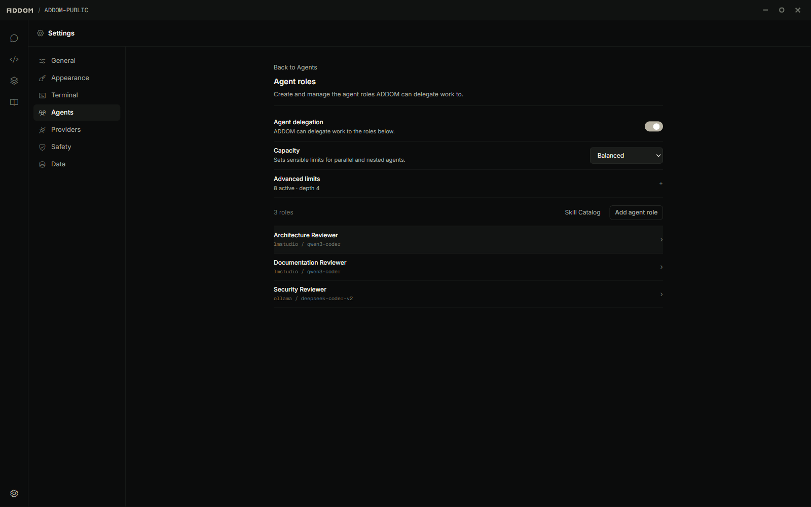
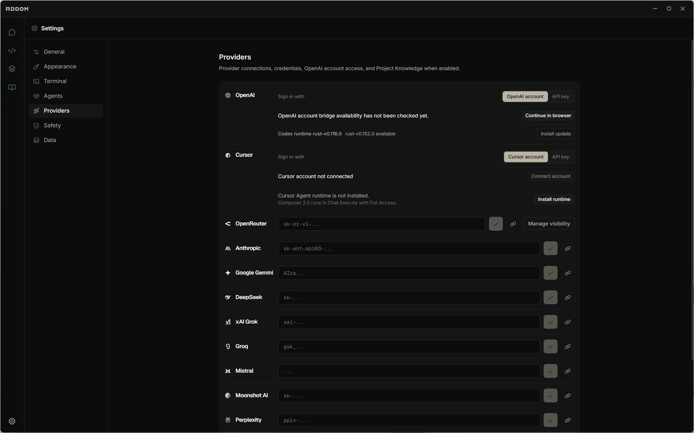

# ADDOM

Local-first desktop workspace for multi-provider AI coding, with guarded tools, an integrated editor, memory, and delegated agents. No telemetry or data collection by the ADDOM developer.



## Project Status

ADDOM `0.1.0-alpha` is early software. Preview builds are prepared for Windows, macOS, and Linux; the Windows installer has been verified locally, while macOS and Linux builds still need broader platform testing. Builds are currently unsigned. Windows builds can check, download, and install updates from ADDOM's official published GitHub releases; macOS and Linux updates remain manual while their packaging paths are hardened.

## Why ADDOM

ADDOM keeps the coding workspace on your computer while letting you choose among supported cloud and local model providers. It combines conversation, project-aware tools, reviewable changes, and agent delegation in one Electron application.

Current capabilities include:

- multi-provider chat with provider and model selection per thread
- guarded filesystem, search, command, and terminal tools
- an integrated Monaco editor, change review, and artifact history
- local thread history, project memory, attachments, and settings
- configurable agent roles with bounded permissions and isolated write workflows
- API-key, supported account-authentication, and local-provider connections

## Run From Source

### Prerequisites

- Node.js 24
- npm
- Git
- platform build prerequisites required by Electron native dependencies
  - On Windows, install Python and Visual Studio Build Tools with the **Desktop development with C++** workload if npm needs to compile a native dependency locally.

```powershell
git clone https://github.com/JosPMSilva/ADDOM.git
cd ADDOM
npm ci
npm run dev
```

`npm ci` installs Electron and validates the portable native assets used by development, tests, and packaging.

## First Run

1. Open **Settings > Providers** and configure an API key, a supported account connection, or an available local provider.
2. Select **Projects > Open folder** and choose the project ADDOM may work with.
3. Create or select a thread.
4. Choose the provider, model, chat mode, and permission mode in the composer.
5. Start with a scoped request, such as asking ADDOM to inspect a file and explain an issue.

For approval behavior and a fuller walkthrough, see the [Quickstart](./docs/quickstart.md).

## Privacy And Provider Boundaries

Project records, thread history, credentials, settings, attachments, and local memory are stored on the device. ADDOM does not include remote telemetry.

Using a remote model still sends the prompt and selected context to that provider. Tool results, hosted provider tools, MCP integrations, and files explicitly added to Project Knowledge may also leave the device according to the selected provider or service. Review provider terms and the active permission mode before working with sensitive repositories.

## Verification And Builds

```powershell
npm run check:syntax
npm run check:eslint
npm run i18n:check
npm run check:docs-links
npm run test:integration
npm run build:renderer
```

Platform package commands are `npm run build:win`, `npm run build:mac`, and `npm run build:linux`. Build a platform target on its native host; generated packages are unsigned unless signing is configured externally.

## Screenshots

**Integrated editor** — project source, symbol outline, problems, and reviewable changes next to the conversation that produced them.



**Agent roles** — delegate bounded tasks to specialist roles, each with its own provider, model, skills, and working scope.



**Provider connections** — configure supported cloud and local providers once, then choose per thread.



## Documentation

- [docs/README.md](./docs/README.md) — documentation index
- [CONTRIBUTING.md](./CONTRIBUTING.md) — contributor workflow
- [SECURITY.md](./SECURITY.md) — security reporting policy
- [CHANGELOG.md](./CHANGELOG.md) — release notes
- [DESIGN.md](./DESIGN.md) — visual design contract

## Architecture At A Glance

- `src/main` owns Electron integration, persistence, providers, tools, agents, credentials, and privileged operations.
- `src/preload` exposes the narrow, versioned `window.addom` bridge.
- `src/renderer` contains the React interface, editor, settings, and projected application state.
- `src/common` contains cross-process contracts and shared policy logic.

See [Agent Orchestration Architecture](./docs/architecture/agent-orchestration.md) and the [window.addom API reference](./docs/reference/window-addom-api.md) for deeper implementation detail.

## License

ADDOM is released under the MIT License. See [LICENSE](./LICENSE).
