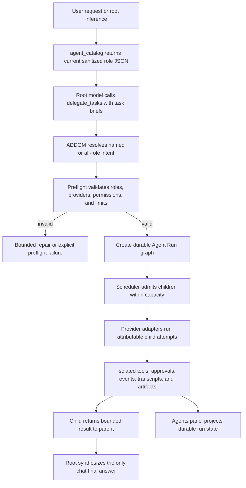

# Agent Delegation Workflow

This document shows the current provider-neutral delegation path. ADDOM owns role
discovery, selection validation, scheduling, permissions, and persistence; a model only
requests work through a compact stable tool contract.

## End-To-End Flow

## Stable Model-Facing Contract

`agent_catalog` is read-only. It lets any supported provider or model inspect the same
application-owned role inventory without parsing screenshots, prompt prose, or private
configuration files.

`delegate_tasks` is the single model-facing dispatch tool. Its task briefs describe the
work and optional role intent; ADDOM converts them to the internal canonical
`delegate_to_agents` executor. This mapping keeps provider schemas compact while the
application retains control of role identity and execution policy.

Requests for all configured roles are expanded from the live catalog. Exact named roles
are resolved before execution, and each requested role is assigned once. The preflight
does not replace an unavailable role with a convenient fallback.

## Runtime Ownership

The main process owns:

- role catalog generation and sanitization
- semantic and exact role resolution
- bounded preflight repair
- provider/model availability checks
- capacity, depth, descendant, token, cost, and duration limits
- child permission inheritance and write isolation
- durable Agent Run, event, transcript, approval, usage, and artifact storage
- root-owned synthesis and final-message authority

Provider adapters may expose different levels of native collaboration detail. The same
Agent Run protocol records managed, native, and honestly opaque children without
inventing unsupported capabilities.

## Primary Modules

- `src/main/moa/agent-catalog-service.mjs`
- `src/main/moa/delegation-request-resolver.mjs`
- `src/main/moa/partial-delegation-preflight.mjs`
- `src/main/chat/delegation-tool-surface.mjs`
- `src/main/chat/moa-tool-flow.mjs`
- `src/main/tools/agent-executor.mjs`
- `src/main/agents/agent-run-service.mjs`
- `src/main/agents/agent-scheduler.mjs`
- `src/main/agents/agent-managed-runtime.mjs`
- `src/main/agents/agent-event-store.mjs`
- `src/main/agents/agent-event-projector.mjs`
- `src/main/agents/workspaces/`
- `src/main/agents/providers/`

The remaining `moa:*` event names and `src/main/moa` directory are legacy internal
identifiers. They do not represent a second user-facing system; the product surface is
called **Agents**.

## Related Docs

- [Agents Guide](../agents-guide.md)
- [Agent Orchestration Architecture](./agent-orchestration.md)
- [Tool Catalog](../reference/tool-catalog.md)
- [Events and Runbook](../reference/events-and-runbook.md)
