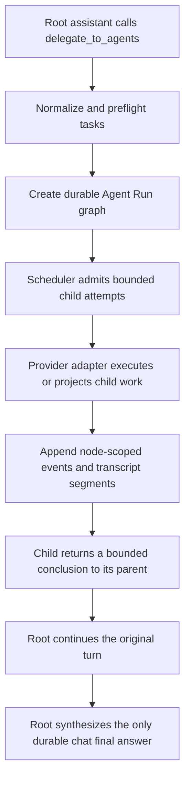

# Agent Orchestration Architecture

## Scope

ADDOM models delegated work as durable, addressable Agent Runs. The root assistant owns
the user conversation and final answer; child agents contribute evidence, changes, and
status through a bounded parent/child runtime.

The canonical architecture covers:

- recursive run, node, and attempt identity
- provider-neutral scheduling and resource limits
- provider-native collaboration projection
- managed child execution and isolated writes
- durable transcripts, events, approvals, usage, and artifacts
- root-owned synthesis and final-message authority

Legacy `MoA` names remain in some main-process planner and executor modules. They are
internal implementation names, not a second renderer store, IPC surface, or user-facing
runtime.

## Canonical Data Model

- **Agent Run:** one delegated graph scoped to a project, thread, and root turn.
- **Agent Node:** one addressable participant in that graph.
- **Agent Attempt:** one execution attempt for a node.
- **Agent Event:** an append-only, ordered lifecycle fact.
- **Transcript segment:** node-scoped conversational content, including the child's final
  return to its parent.

`agent_runs`, `agent_nodes`, and the related normalized tables are authoritative.
Renderer state is a projection and may be rebuilt from persisted events after restart.

## Primary Modules

- `src/main/agents/agent-managed-runtime.mjs`
- `src/main/agents/agent-run-service.mjs`
- `src/main/agents/agent-scheduler.mjs`
- `src/main/agents/agent-event-store.mjs`
- `src/main/agents/agent-event-projector.mjs`
- `src/main/agents/agent-run-query-service.mjs`
- `src/main/agents/agent-run-finalizer.mjs`
- `src/main/agents/agent-resource-governor.mjs`
- `src/main/agents/agent-permission-resolver.mjs`
- `src/main/agents/agent-message-broker.mjs`
- `src/main/agents/workspaces/`
- `src/main/agents/providers/`
- `src/main/tools/agent-executor.mjs`
- `src/main/chat/moa-tool-flow.mjs`
- `src/main/chat/moa-synthesis-finalizer.mjs`

## Root-to-Child Flow

Direct role mentions use the same flow. They require delegation inside the ordinary root
turn; they do not bypass the orchestrator or write an assistant answer directly.

## Provider Boundary

Every provider is represented through the same Agent Run protocol:

- ADDOM-managed adapters execute child turns under the managed scheduler.
- Native-capable providers project attributable child identities and lifecycle events.
- Partially observable providers create honest opaque nodes rather than fabricated
  lineage or unsupported controls.

Capability snapshots are persisted with each run and node. The renderer only offers
controls that the active adapter can actually perform.

## Scheduling and Safety

`agentSettings` selects the default capacity profile and bounded overrides. Hard ceilings
remain enforced in the main process even if settings or provider metadata are malformed.

The runtime enforces:

- live-agent, depth, descendant, token, cost, and duration limits
- optional per-provider concurrency caps
- child permission inheritance that can narrow, never widen, root authority
- attempt-scoped approvals
- required write isolation through staged overlays or managed worktrees
- cancellation, retry, and shutdown cleanup

Waiting parents release execution capacity so recursive descendants cannot deadlock
behind their ancestors.

## Child Returns and Final Authority

Child final messages are ordinary Markdown transcript segments attached to the child
node. The parent receives a bounded, attributable return rather than a raw concatenation
of every child transcript.

For large fan-out:

- detailed child work remains available in the Agents navigator
- the parent receives reduced findings and evidence
- the root synthesizes conclusions and next actions
- only the root persists the chat final answer

If the user already authorized fixes, the root may continue into implementation after
review. For review-only requests, the root reports findings and asks before mutation.

## Renderer and IPC

The preload exposes two narrow surfaces:

- `window.addom.agents` for role templates, role creation, and delegation cost consent
- `window.addom.agentRuns` for scoped list/get/page/subscribe/control/message/retry,
  queue, approval, and artifact operations

The renderer consumes canonical projections through:

- `src/renderer/components/chat/chat-event-bridge-agents.mjs`
- `src/renderer/store/useAgentRunStore.js`
- `src/renderer/components/agents/AgentNavigatorPanel.jsx`
- `src/renderer/components/agents/AgentConversationView.jsx`
- `src/renderer/components/agents/AgentStreamReferenceGroup.jsx`

The right-side Agents panel is a compact navigator, not a fleet dashboard. Selecting a
row opens that child's ordinary conversation in the main viewport.

## Persistence and Legacy Import

Schema v21 imports valid flat `moa_transactions` rows as root-only completed Agent Runs.
It does not invent missing child lineage. The original rows are copied to
`moa_transactions_legacy_backup_v21` for rollback evidence, and the active legacy table
is removed in the same transaction.

The backup is not read by the runtime and is retained only until migration rollback
signoff.

## Failure Modes

- **Preflight failure:** malformed task, unresolved configured role, or unavailable
  provider/model.
- **Admission rejection:** a hard capacity or budget ceiling would be exceeded.
- **Stale:** an agent stream produced no progress within its idle budget.
- **Timeout:** the attempt or delegation exhausted its total duration budget.
- **Opaque capability:** the provider cannot expose reliable child detail or control.
- **Interrupted recovery:** restart reconciliation marks or resumes work according to the
  persisted provider capability and ownership state.

Failures remain node-attributed. A partial run can return useful completed evidence while
making failed or unavailable children explicit.

## Related Docs

- [Agents Guide](../moa-guide.md)
- [Settings Reference](../settings-reference.md)
- [window.addom API](../reference/window-addom-api.md)
- [Events and Runbook](../reference/events-and-runbook.md)
