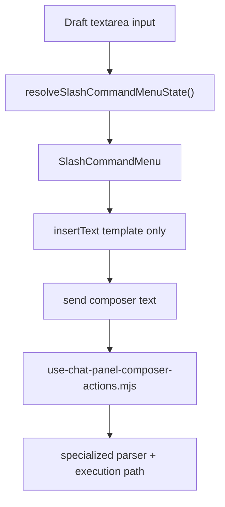

# Chat Command Surface Architecture

## Scope
This document covers the chat-composer command surface:
- slash command discovery and registry
- direct agent mention syntax
- `/createrole`, `/pipeline`, `/council`, `/review`, compaction, and dispatch parsing
- insertion UI vs execution path separation

## Primary Modules
- `src/renderer/components/chat/slash-command-registry.mjs`
- `src/renderer/components/chat/SlashCommandMenu.jsx`
- `src/renderer/components/chat/ChatComposerDraftTextarea.jsx`
- `src/renderer/components/chat/use-chat-panel-composer-actions.mjs`
- `src/renderer/components/chat/direct-agent-command-parser.mjs`
- `src/renderer/components/chat/role-command-parser.mjs`
- `src/renderer/components/chat/dispatch-command-parser.mjs`
- `src/renderer/components/chat/pipeline-command-parser.mjs`
- `src/renderer/components/chat/council-command-parser.mjs`
- `src/renderer/components/chat/review-command-parser.mjs`
- `src/renderer/components/chat/ComposerAgentQuickMenu.jsx`

## Two Layers
ADDOM deliberately separates:
1. command discovery/insertion
2. command execution

The slash menu is only a discovery and insertion UI. It does not execute commands directly.

Execution stays in `use-chat-panel-composer-actions.mjs`, which inspects the final composer text on send and routes to the right specialized action.

## Slash Command Registry
`slash-command-registry.mjs` is the extensibility surface for the slash menu.

Each command entry defines:
- `id`
- `label`
- `description`
- `category`
- `aliases`
- `insertText`
- `example`

Current top-level slash commands:
- `/compact`
- `/compact-threshold`
- `/agent`
- `/agents`
- `/createrole`
- `/dispatch`
- `/pipeline`
- `/council`
- `/review`

Registry helpers:
- `resolveSlashCommandQuery()`
- `filterSlashCommands()`
- `resolveSlashCommandMenuState()`
- `applySlashCommandSelection()`

## Slash Menu Flow

## Direct Agent Mentions
Direct agent dispatch uses `direct-agent-command-parser.mjs`, not `role-command-parser.mjs`.

Supported direct mention syntax:
- `@roleId <instruction>`
- `@{Role Name} <instruction>`
- repeated mentions for fanout

It also supports explicit slash delegation:
- `/agent <role> :: <instruction>`
- `/agents <role1>, <role2> :: <instruction>`

`ComposerAgentQuickMenu.jsx` exists to insert those mentions from UI without forcing the user to remember the exact role id/name syntax.

## `/createrole`
`role-command-parser.mjs` only owns `/createrole`.

It parses:
- `/createrole <free-text description>`

Then `buildRoleGenerationPrompts()` generates a model-facing JSON-only prompt to produce a new role definition candidate.

Important:
- `@mentions` are for dispatching to existing roles
- `/createrole` is for generating a new role definition

## Dispatch, Pipeline, Council, Review
- `dispatch-command-parser.mjs`
  - decomposes a task into multiple role-targeted sub-tasks
- `pipeline-command-parser.mjs`
  - supports `/pipeline list`
  - supports `/pipeline <pipelineId> [context]`
- `council-command-parser.mjs`
  - supports `/council <instruction>`
- `review-command-parser.mjs`
  - supports `/review <context>`

These parsers do not own the transport. They only produce a normalized command payload for the send-action layer.

## Execution Layer
`use-chat-panel-composer-actions.mjs` is the central dispatcher. It decides whether the composer text should:
- send a normal chat turn
- run compaction
- dispatch direct agents
- generate a role
- decompose a dispatch
- execute a pipeline
- start a council run
- invoke the review workflow

## Extension Rules
To add a new slash command cleanly:
1. Add metadata to `slash-command-registry.mjs`.
2. Add a dedicated parser module if the shape is non-trivial.
3. Wire the parser into `use-chat-panel-composer-actions.mjs`.
4. Add integration coverage for discoverability, parser behavior, and execution routing.

## Related Docs
- [Chat Guide](../chat-guide.md)
- [MoA Guide](../moa-guide.md)
- [window.addom API](../reference/window-addom-api.md)
