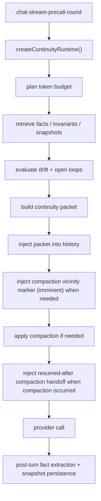

# Continuity System Architecture

## Scope
This document covers the continuity subsystem in `src/main/chat/continuity/`.

It explains:
- packet budgeting
- fact and invariant retrieval
- drift checks
- compaction
- compaction boundary-awareness handoff
- packet persistence
- pre-call and post-turn lifecycle

## Subsystem Modules
- `continuity-policy.mjs`
- `token-budget-planner.mjs`
- `retrieval-engine.mjs`
- `continuity-store.mjs`
- `continuity-facts.mjs`
- `fact-status.mjs`
- `open-loop-tracker.mjs`
- `packet-builder.mjs`
- `packet-schema.mjs`
- `packet-injection.mjs`
- `continuity-refresh-policy.mjs`
- `drift-guard.mjs`
- `compaction-engine.mjs`
- `compaction-handoff-state.mjs`
- `compaction-handoff-prompt.mjs`
- `continuity-runtime.mjs`
- `provider-native/openai-compaction-adapter.mjs`

## High-Level Flow

## Policy Layer
`continuity-policy.mjs` defines the stable contract for continuity settings:
- enabled/disabled
- `architecture`
- `defaultScope`
- active profile
- drift/invariant/contradiction toggles
- provider-native compaction toggle and allowlist

## Budget Planner
`token-budget-planner.mjs` converts:
- model limit
- expected output reserve
- tool reserve
- occupancy estimate
- active profile

into a continuity packet budget.

## Retrieval Layer
`retrieval-engine.mjs` pulls three persisted sources:
- continuity facts
- continuity invariants
- continuity snapshots

It ranks facts and invariants using:
- user-message token overlap
- confidence
- recency

## Fact and Invariant Derivation
After a turn finishes, `continuity-facts.mjs` derives new continuity facts from the completed turn and tool results.

Persisted stores in `continuity-store.mjs` include:
- `continuity_facts`
- `continuity_invariants`
- `continuity_snapshots`

## Open Loops and Drift
`open-loop-tracker.mjs` detects unresolved tasks or commitments from facts and can auto-close loops when later evidence resolves them.

`drift-guard.mjs` checks whether selected facts and invariants contradict each other. It emits:
- `driftRisk`
- violation count
- contradiction details

## Packet Builder
`packet-builder.mjs` maps retrieved evidence into a structured packet with sections such as:
- `session_state`
- `active_goals`
- `decisions`
- `open_loops`
- `critical_errors`
- `file_state_refs`
- `invariants`
- `source_refs`

It then renders a bounded text packet suitable for prompt injection.

## Refresh and Injection
`continuity-refresh-policy.mjs` decides whether an existing packet should be reused or refreshed based on:
- round number
- occupancy ratio
- drift
- selection change

`packet-injection.mjs` materializes the packet into the message history.

## Compaction
`compaction-engine.mjs` shrinks the prompt history after packet injection when continuity would otherwise oversubscribe the context window.

For OpenAI, `provider-native/openai-compaction-adapter.mjs` can optionally defer compaction to provider-native support when policy allows it.

## Compaction Handoff Layer
Compaction is treated as a boundary event, not only a token-reduction operation.

`compaction-handoff-state.mjs` builds the carry-forward payload:
- `compactionEvent` (`occurred`, `type`, `phase`, `source`, `confidence`)
- `workState` (objective, active files, recent edits, next step, open loops)
- `planState` (mode, resolved/open questions, ordered steps, immediate next step)

`compaction-handoff-prompt.mjs` renders two bounded prompt artifacts:
- `[ADDOM Compaction Marker]` for `imminent` or `resumed_after` awareness
- `[ADDOM Compaction Handoff]` for canonical post-boundary carry-forward

Deterministic prompt ordering for resumed turns:
1. system prompt/runtime context
2. continuity packet
3. compaction marker/handoff (when present)
4. current turn input

The OpenAI request-context contract also carries compaction boundary metadata:
- `compactionEventType`
- `compactionEventPhase` (`imminent|applied|resumed_after`)
- `compactionEventOccurred`
- `canonicalHandoffUsed`
- `carryForwardSource` (`continuity_packet_only|compaction_handoff_only|both`)

Runtime diagnostics keep raw key/value detail. User-facing timeline output uses concise rendered compaction lines.

## Runtime API
`continuity-runtime.mjs` is the orchestrator. It exposes the before/after turn lifecycle:
- `applyBeforeModelCall()`
- packet reuse or refresh
- drift handling
- compaction application
- packet persistence
- post-turn continuity persistence

It emits two live IPC channels:
- `chat:continuity-status`
- `chat:continuity-packet`

It also persists timeline events such as:
- `continuity_retrieval_used`
- `continuity_packet_built`
- `continuity_compaction_applied`
- `continuity_drift_detected`
- `continuity_invariant_violated`

## Verification Coverage
Compaction boundary-survival is covered by:
- `tests/integration/compaction-handoff.test.mjs`
- `tests/integration/chat-stream-precall-round.test.mjs`
- `tests/integration/chat-stream-openai-round.test.mjs`
- `tests/integration/compaction-mode-regression-matrix.test.mjs`
- `tests/integration/compaction-boundary-awareness-regression.test.mjs`
- `tests/integration/compaction-task-fidelity-evals.test.mjs`

## Why This Is a Subsystem
Continuity is not a single helper. It owns:
- retrieval
- ranking
- packet construction
- quality control
- persistence
- prompt mutation
- diagnostics

## Related Docs
- [Core Concepts](../core-concepts.md)
- [Settings Reference](../settings-reference.md)
- [Events and Runbook](../reference/events-and-runbook.md)
- [Event Bridge and Execution Stream](./event-bridge-and-execution-stream.md)
