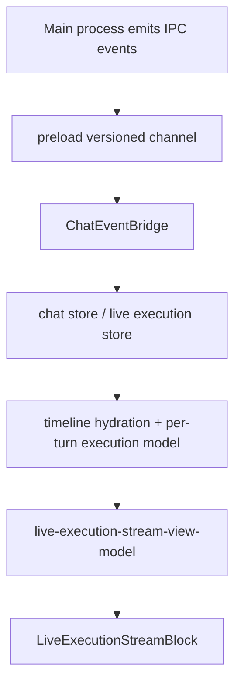

# Event Bridge and Execution Stream Architecture

## Scope
This document covers how live turn activity travels from the main process into the renderer and becomes:
- timeline activity rows
- runbook blocks
- live execution stream rows
- reasoning cards or milestone rows

It also covers the compact terminal-session diagnostic path. The execution stream is not a terminal emulator and does not mirror full PTY transcripts.

## Primary Modules
- `src/renderer/components/ChatEventBridge.jsx`
- `src/renderer/components/chat/chat-event-bridge-stream-runtime.mjs`
- `src/renderer/components/chat/chat-event-bridge-openai.mjs`
- `src/renderer/components/chat/chat-event-bridge-agents.mjs`
- `src/renderer/store/useChatStore.js`
- `src/renderer/store/chat/live-execution-store.mjs`
- `src/renderer/components/chat/live-execution-stream-view-model.mjs`
- `src/renderer/components/chat/live-execution-reasoning-render.mjs`
- `src/renderer/components/chat/LiveExecutionStreamBlock.jsx`
- `src/renderer/store/chat/timeline-hydration.mjs`

## Decomposition
`ChatEventBridge.jsx` is the renderer ingress point, but not a monolith.

The split is:
- `ChatEventBridge.jsx`
  - generic subscription setup
  - plain chunk/done/error/tool lifecycle wiring
- `chat-event-bridge-stream-runtime.mjs`
  - buffered text/reasoning flush
  - stream stats
  - reasoning meta sync
- `chat-event-bridge-openai.mjs`
  - OpenAI-specific continuity/background/websocket events
- `chat-event-bridge-agents.mjs`
  - durable Agent Run activation, scoped subscriptions, and batched graph projection

## High-Level Flow

## Stream Runtime
`chat-event-bridge-stream-runtime.mjs` maintains independent text and reasoning buffers per message id.

It tracks:
- `startedAt`
- `firstTextChunkAt`
- `firstReasoningChunkAt`
- `lastChunkAt`
- flush counts
- character counts

This is why assistant text and reasoning can be rendered separately without losing liveness stats.

## Live Execution Store
`live-execution-store.mjs` builds a separate per-turn execution model from timeline/tool activity.

It treats these as first-class:
- tool sessions grouped by `stepId`
- stdout/stderr live output
- reasoning events
- continuity events
- transport status events

This store is intentionally not the same thing as message rendering. The execution stream is a derived operational view of the turn.

Terminal session activity is treated as tool activity with terminal-specific metadata:
- `terminal_session_open|attach|write|resize|signal|close` remain normal tool events
- the store keeps concise lifecycle/result rows and bounded terminal previews only
- the dedicated Terminal panel remains the primary interactive surface for PTY output
- the Terminal panel is a real emulator-backed surface, not a transcript viewport:
  - renderer terminal semantics are handled by `@xterm/xterm`
  - PTY output is replayed as raw terminal data
  - the execution stream does not provide a hidden interactive fallback path

## Execution Stream View Model
`live-execution-stream-view-model.mjs` is the classifier/normalizer that decides what kind of row each event becomes.

It distinguishes between:
- generic activity rows
- tool output rows
- continuity/runtime diagnostics rows
- reasoning rows

It also decides whether reasoning should render as:
- `narrative_block`
- `milestone_step`

This is how codex-style short headings avoid rendering as giant prose cards while GPT-5.1 narrative reasoning still becomes structured prose.

For terminal sessions specifically:
- `live-execution-stream-tooling.mjs` and `live-execution-stream-view-model.mjs` map explicit `terminal_session_*` tools to compact progress/result labels
- terminal output preview is bounded and summary-oriented
- terminal session runtime gating does not create a hidden fallback path in the execution stream; when runtime health is not `supported`, the terminal tool family is removed before execution

## Historical Hydration
Execution stream state is not live-only.

`timeline-hydration.mjs` reconstructs the same activity surface from persisted timeline rows on reload. That is why:
- old turns still show execution stream history
- Agent Run references and child conversations survive restarts
- continuity and websocket recovery events reappear after hydration

Terminal session lifecycle rows also rehydrate from persisted tool/timeline activity, but full PTY transcripts do not.

## Rollout Boundary
Terminal session events only reach the execution stream when the terminal subsystem is enabled by runtime health.

Current rollout boundary:
- Windows direct PTY validation currently covers:
  - `cmd`
  - `powershell.exe`
  - redraw-heavy output
  - fullscreen TUI-style interaction
- Windows packaged runtime still requires a fresh rebuild/smoke rerun on a machine that can restore the Electron native `node-pty` ABI
- macOS and Linux remain explicitly rollout-gated until packaged verification is recorded there
- renderer terminal disabled states come from the same runtime-health contract used to suppress model-facing `terminal_session_*` tool exposure

## Related Docs
- [Events and Runbook](../reference/events-and-runbook.md)
- [Chat Guide](../chat-guide.md)
- [Continuity System Architecture](./continuity-system.md)
- [Reasoning Render Pipeline](./reasoning-render-pipeline.md)
