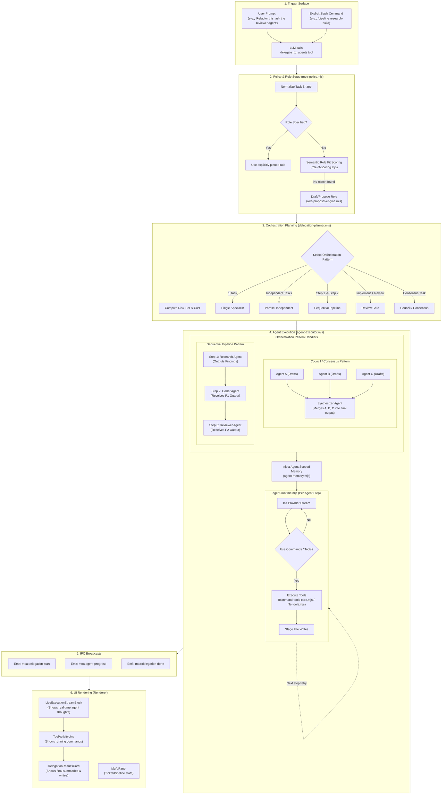

# MoA, Commands, and Task Delegation Workflow

This document visualizes the complete lifecycle of a Mixture of Agents (MoA) task delegation in ADDOM, from the initial user request through role resolution, orchestration planning, tool execution, and UI rendering.

## Architecture Diagram

## Key Workflow Steps

1. **Trigger Phase**: The process begins either via direct chat ("Ask the test agent to write unit tests for this file"), an explicit slash command (like `/pipeline`), or a generic LLM dynamically deciding to use the `delegate_to_agents` tool.
2. **Policy & Role Setup**: `moa-policy.mjs` normalizes the request. If the user didn't specify exactly *which* agent should handle it, `role-fit-scoring.mjs` uses semantic matching (checking overlap between the task description and built-in skill catalogs/agent instructions) to find the best fit. If it fails, the system drafts a proposed role to the user.
3. **Orchestration Planning**: `delegation-planner.mjs` looks at the tasks and calculates the risk and estimated cost. Based on the shapes of the tasks, it assigns an orchestration pattern. Two of the most powerful patterns are:
   - **Sequential Pipeline**: Explicit, multi-step workflows. The output of Step 1 (e.g., a "research_agent" creating a plan) is automatically injected into the `injected_context` of Step 2 (e.g., a "coder_agent" implementing the plan). Pipelines can be triggered dynamically by the planner or explicitly by the user (e.g., `/pipeline research-build`).
   - **Council (Consensus)**: A multi-member pattern designed for complex decisions or high-risk tasks. The same task is sent to multiple different agent roles simultaneously. Once all members finish drafting their responses, a final "Synthesizer" agent reviews all the drafts and merges them into a single, cohesive consensus result.
4. **Execution**: `agent-executor.mjs` handles the overarching pattern (manages handoffs in a pipeline, or the synthesis in a council). `agent-runtime.mjs` runs the actual model stream for a given agent step. This is where the agent can interact with **Commands** (exposed tools validated through `command-tools-core.mjs` and executing in the background sandbox).
5. **IPC & Rendering**: As agents think, use tools, and stage files, events are broadcast via IPC to the frontend. The renderer hydrated these events into the `LiveExecutionStreamBlock` (for real-time tracking) and ultimately a `DelegationResultsCard` summarizing what was accomplished.
