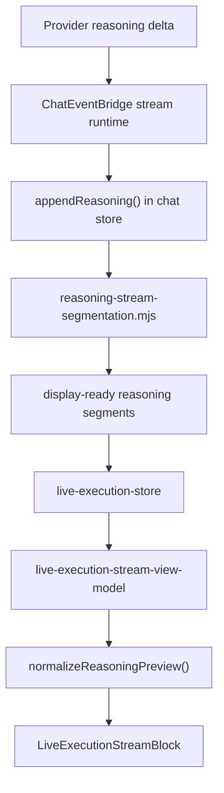

# Reasoning Render Pipeline

## Scope
This document covers how reasoning moves from provider deltas into:
- stored reasoning segments
- live execution stream rows
- structured reasoning prose or milestones

## Primary Modules
- `src/renderer/store/chat/use-chat-store-reasoning-actions.mjs`
- `src/renderer/store/chat/reasoning-stream-segmentation.mjs`
- `src/renderer/components/chat/live-execution-reasoning-render.mjs`
- `src/renderer/components/chat/live-execution-stream-view-model.mjs`
- `src/renderer/components/chat/LiveExecutionStreamBlock.jsx`

## Pipeline

## Store Layer
`use-chat-store-reasoning-actions.mjs` appends raw reasoning to the assistant message and uses `reasoning-stream-segmentation.mjs` to decide what should be visible as display-ready reasoning.

Raw reasoning accumulation and UI-ready reasoning are not the same thing.

## Segmentation
`reasoning-stream-segmentation.mjs` converts bursty or fragmented deltas into cleaner segments for the live execution store.

This prevents the UI from rendering one timeline row per micro-fragment.

## Normalization
`live-execution-reasoning-render.mjs` performs renderer-side cleanup on the grouped text:
- repairs broken stream words
- splits inline heading candidates into real section breaks
- converts heading-like paragraphs to markdown headings
- normalizes malformed inline and backtick code fragments
- strips internal protocol markers such as `addom_plan`

## Classification
`live-execution-stream-view-model.mjs` decides whether grouped reasoning should render as:
- `narrative_block`
- `milestone_step`

That classification is shape-first:
- short heading-only codex milestones become compact step rows
- heading plus prose or multi-paragraph reasoning becomes a structured reasoning block

## Final Rendering
`LiveExecutionStreamBlock.jsx` renders:
- milestone reasoning as compact timeline rows
- narrative reasoning as structured prose cards using the stream prose variant

## Design Constraints
- Do not trust providers to emit perfect markdown.
- Do not expose internal plan protocol markers to users.
- Do not couple reasoning rendering to a single model family.
- Preserve historical turns through hydration using the same normalization logic.

## Related Docs
- [Event Bridge and Execution Stream](./event-bridge-and-execution-stream.md)
- [Events and Runbook](../reference/events-and-runbook.md)
- [Chat Guide](../chat-guide.md)
