# Idle-safe application updates

## Status

Approved architectural direction recorded on 2026-09-04. The sidebar icon, animation, hover information, and detailed interaction treatment remain under design discussion and are intentionally not specified here.

## Goal

Notify people when a supported ADDOM update is available, let them follow its download state from the main sidebar, and install it only when doing so cannot interrupt active or unsaved work.

## Existing foundation

ADDOM already uses `electron-updater` against the official `JosPMSilva/ADDOM` GitHub release feed. The main process can check, download, report progress, and call `quitAndInstall()`. A manual Updates section exists under Settings. The current implementation checks once shortly after launch, keeps update state inside the mounted Settings component, enables automatic installation on ordinary app quit, and does not perform an application-wide idle check before installation.

Automatic update metadata is currently packaged for Windows. macOS and Linux updates remain manual. Published alpha artifacts are currently unsigned, so unattended installation is outside this design.

## Product behavior

1. ADDOM checks for an update shortly after application launch.
2. While ADDOM remains open, the main process checks again every 30 minutes. Checks continue while the window is hidden in the system tray.
3. Checks never overlap. A check is skipped while another check or download is in progress.
4. No sidebar update control is shown while ADDOM is checking, is current, is unsupported, or encounters a check error before discovering a newer version.
5. After a newer version is discovered, the sidebar control appears above Settings and remains visible through the available, downloading, download-error, and ready states.
6. Downloading begins only after an explicit user action. Downloading may continue while other work runs because it does not stop application processes.
7. Installation always requires an explicit user action and final confirmation.
8. If ADDOM is busy, the application explains what is blocking installation and leaves all work running.
9. ADDOM never cancels work to manufacture an idle state for an update.
10. Once idle and confirmed, ADDOM briefly prevents new work from starting, rechecks activity, prepares resources for exit, and invokes the updater installer.

## Architecture

### Main-process update controller

A single main-process controller owns the updater instance, schedule, current snapshot, and valid state transitions. It retains state even when the Settings panel is unmounted or the renderer window is hidden.

The public snapshot contains only renderer-safe information:

```text
phase: hidden | checking | available | downloading | ready | installing | error
version: string or null
progressPercent: integer from 0 through 100
errorCode: unavailable | network | generic | null
checkedAt: timestamp or null
downloadedAt: timestamp or null
installBlockers: summarized blocker counts and categories
```

The known update version remains present after a download error so the sidebar can offer a retry. Errors from checks made before a version is known remain visible in Settings but do not create sidebar chrome.

The launch check runs after Electron is ready and the main window has been initialized. Subsequent checks use a completion-based 30-minute timer rather than a free-running interval, preventing concurrent checks after a slow network request or system sleep. A resume event may trigger a check when the last completed check is older than 30 minutes.

### Renderer projection

The preload bridge exposes narrow query, command, and subscription functions rather than the raw updater or IPC primitives:

```text
getUpdateState()
checkForUpdates()
downloadUpdate()
requestInstall(preflight)
onUpdateStateChanged(callback)
```

An application-level renderer store hydrates from `getUpdateState()` before relying on events. This closes the current missed-event gap and gives the sidebar and Settings the same state. Settings retains the detailed manual controls and error copy; the sidebar is the compact notification and primary status surface.

### Global activity gate

The main process owns the authoritative install decision. A global activity monitor combines existing runtime sources and returns a reasoned snapshot rather than a single renderer-derived boolean.

Installation blockers are:

- any active chat stream in any project, thread, or window;
- managed agent work that is queued, starting, running, waiting, paused, approval-required, or cancelling;
- detached OpenAI background responses that are not terminal;
- running background commands;
- tracked Cursor agent processes;
- live or closing terminal sessions;
- unresolved execution approvals or user questions associated with unfinished work;
- unsaved editor tabs reported by the active renderer during install preflight; and
- any other runtime resource whose normal shutdown would terminate user-owned work.

For the first implementation, every live terminal session is a blocker. Reliably distinguishing an idle interactive shell from an important foreground process is platform-specific and is not required for this feature.

### Safe installation transaction

The installation path is an atomic, fail-closed transaction:

1. Verify that a downloaded update is ready.
2. Collect a fresh main-process activity snapshot and the renderer's dirty-tab preflight.
3. If blockers exist, return them without mutating or cancelling runtime state.
4. If no blockers exist, enter a short `quiescing` condition that rejects new chat, agent, background-process, and terminal starts.
5. Collect the activity snapshot again.
6. If work appeared before the gate closed, leave quiescing and return to the ready state.
7. If ADDOM remains idle, call the existing coordinated resource preparation path.
8. Invoke `quitAndInstall()` only after preparation succeeds.

`autoInstallOnAppQuit` is disabled. A downloaded update is installed only through this guarded transaction, never as a side effect of an unrelated quit.

## State transitions

```mermaid
stateDiagram-v2
    [*] --> Hidden
    Hidden --> Checking: launch or 30-minute schedule
    Checking --> Hidden: current, unsupported, or pre-detection error
    Checking --> Available: newer version detected
    Available --> Downloading: user starts download
    Downloading --> Available: download fails; retry remains available
    Downloading --> Ready: package downloaded and verified
    Ready --> Ready: install blocked by activity
    Ready --> Installing: idle, confirmed, quiesced, and rechecked
    Installing --> [*]: restart and apply
```



## Failure behavior

- Network and feed errors are sanitized before crossing IPC boundaries.
- Background check failures never interrupt work or produce a persistent sidebar item when no update is known.
- Download failures preserve the discovered version and expose a retry action.
- An activity-query failure blocks installation and reports a generic safety reason.
- A renderer that cannot provide its dirty-tab state blocks installation rather than assuming files are saved.
- If resource preparation fails, ADDOM remains open where possible, releases the quiescing condition, and keeps the update in the ready state.
- If the downloaded artifact is invalid, the controller clears ready state and requires a fresh download.

## Release constraints

- The update feed remains restricted to the official ADDOM GitHub repository over HTTPS.
- The initial automatic-check and guarded-install experience is Windows-only because only Windows packages currently include updater metadata.
- Update checks may include matching prereleases when the installed ADDOM version is itself a prerelease.
- Fully automatic download or installation is not part of this design.
- Signed release artifacts are required before considering unattended update behavior in a future design.

## Verification strategy

Focused automated coverage should prove:

- one launch check and completion-based 30-minute scheduling;
- no overlapping checks or downloads;
- durable snapshot hydration after events occur before renderer subscription;
- valid state transitions and sanitized failures;
- sidebar visibility only after an update version is known;
- shared state between the sidebar and Settings;
- every activity source independently blocks installation;
- blocker summaries do not expose prompts, commands, filenames, or other sensitive content;
- installation never calls cancellation APIs;
- quiescing rejects new work and closes the preflight race;
- `quitAndInstall()` is unreachable while any blocker exists; and
- the packaged Windows build can discover, download, and stage a test update using generated `latest.yml` and blockmap artifacts.

## Deferred decisions

The following items are deliberately excluded from the approved architecture and will be resolved in the sidebar-control design:

- icon glyphs and weights;
- motion and reduced-motion behavior;
- circular progress treatment;
- hover, focus, tooltip, and expanded-sidebar copy;
- ready-versus-blocked visual treatment; and
- whether a future release should offer an explicitly armed “Install when idle” action.
