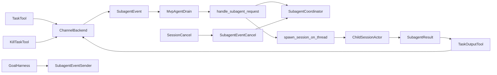

# Grok Build: Agent / Subagent Lifecycle (Read-Only)

End-to-end flow: model-facing tools → in-process channel backend → `MvpAgent` coordinator drain → `handle_subagent_request` → hidden child `SessionActor` → completion / poll / cancel / cleanup.

---

## Evidence Table

| Concern | Path | Rust symbols |
|--------|------|--------------|
| **Spawn entry — `task` tool** | `crates/codegen/xai-grok-tools/src/implementations/grok_build/task/mod.rs` | `TaskTool`, `TaskTool::run`, `MAX_SUBAGENT_DEPTH` |
| **Spawn input schema** | `crates/common/xai-tool-types/src/task.rs` | `TaskToolInput`, `SubagentCapabilityMode`, `SubagentIsolationMode` |
| **Tool requires poll + kill** | `crates/codegen/xai-grok-tools/src/implementations/grok_build/task/mod.rs` | `TaskTool::requires_expr` |
| **Backend trait (transport contract)** | `crates/codegen/xai-grok-tools/src/implementations/grok_build/task/backend.rs` | `SubagentBackend`, `ChannelBackend`, `SubagentBackendResource` |
| **Coordinator message protocol** | `crates/codegen/xai-grok-tools/src/implementations/grok_build/task/types.rs` | `SubagentEvent`, `SubagentRequest`, `SubagentResult`, `SubagentQueryRequest`, `SubagentCancelRequest`, `SubagentEventSender` |
| **Injected tool resources** | same | `SubagentDepthCounter`, `SessionIdResource`, `CurrentPromptIdResource`, `TaskModelValidator` |
| **Poll / wait tool** | `crates/codegen/xai-grok-tools/src/implementations/grok_build/task_output/mod.rs` | `TaskOutputTool`, `capped_wait_timeout`, `MAX_WAIT_BLOCK` |
| **Kill tool (terminal then subagent)** | `crates/codegen/xai-grok-tools/src/implementations/grok_build/kill_task/mod.rs` | `KillTaskTool::run` → `SubagentBackend::cancel` |
| **Backend wired at session rebuild** | `crates/codegen/xai-grok-shell/src/session/agent_rebuild.rs` | `AgentRebuildSpec::build_agent_with_initial_overrides` |
| **Coordinator startup (single drain)** | `crates/codegen/xai-grok-shell/src/agent/mvp_agent/subagent_coordinator.rs` | `MvpAgent::start_subagent_coordinator` |
| **Coordinator invoked from ACP agent init** | `crates/codegen/xai-grok-shell/src/agent/mvp_agent/acp_agent.rs` | `start_subagent_coordinator()` |
| **Channel + coordinator state on agent** | `crates/codegen/xai-grok-shell/src/agent/mvp_agent/mod.rs` | `subagent_event_tx`, `subagent_event_rx`, `subagent_coordinator` |
| **Registry data model** | `crates/codegen/xai-grok-shell/src/agent/subagent/mod.rs` | `SubagentCoordinator`, `PendingSubagent`, `SubagentTracker`, `CompletedSubagent` |
| **Registry lifecycle ops** | `crates/codegen/xai-grok-shell/src/agent/subagent/coordinator_lifecycle.rs` | `insert_pending`, `insert`, `move_to_completed`, `cancel_with_outcome`, `cancel_by_parent_prompt_id`, `mark_backgrounded`, `drain_pending_completions` |
| **Query / snapshot / block-wait** | `crates/codegen/xai-grok-shell/src/agent/subagent/coordinator_query.rs` | `lookup`, `resolve_snapshot`, `is_running`, `register_block_wait`, `block_wait_delivered_or_live`, `evict_stale_completed` |
| **Spawn orchestration** | `crates/codegen/xai-grok-shell/src/agent/subagent/handle_request.rs` | `handle_subagent_request` |
| **Spawn context bag** | `crates/codegen/xai-grok-shell/src/agent/mvp_agent/subagent_coordinator.rs` | `build_subagent_spawn_context`, `try_build_subagent_spawn_context` |
| **Pure resolution (roles/personas/resume)** | `crates/codegen/xai-grok-subagent-resolution/src/lib.rs` | `resolve_effective_overrides`, `validate_resume_identity` |
| **Parent/child identity** | `task/types.rs`, `handle_request.rs`, `spawn.rs` | `SubagentRequest.id` (= child session id), `parent_session_id`, `parent_prompt_id`, `child_session_id` |
| **Depth limit** | `task/mod.rs`, `handle_request.rs`, `spawn.rs` | `MAX_SUBAGENT_DEPTH=1`, `SubagentDepthCounter`, `tool_ctx.subagent_depth = parent_depth + 1` |
| **Concurrency / scheduling** | `subagent_coordinator.rs` | Per-event `tokio::task::spawn_local` (Spawn, Query, ValidateType, DescribeType) |
| **Foreground default vs background** | `task.rs`, `task/mod.rs` | `run_in_background` defaults true; blocking awaits `backend.spawn()` |
| **Foreground await budget + auto-background** | `handle_request.rs`, `mod.rs` | `subagent_await_budget`, `SUBAGENT_AWAIT_BUDGET`, `ForegroundWait::Budget`, `SubagentResult.backgrounded` |
| **Parent turn blocking depth** | `handle_request.rs`, `tool_context.rs` | `BlockingWaitGuard`, `parent_blocking_wait_depth` |
| **Turn-active flag (shared)** | `coordinator_lifecycle.rs`, `tasks_cancel.rs` | `is_turn_active`, `TurnActiveGuard` |
| **Prompt scoping for cancel** | `notification_drain.rs`, `tasks_cancel.rs`, `turn.rs` | `CurrentPromptIdResource`, `TurnSubagentScopeGuard`, `cancel_running_turn_subagents` |
| **Status transitions** | `task/types.rs`, `coordinator_lifecycle.rs` | `SubagentSnapshotStatus`, `SubagentResult::status`, pending→active→completed |
| **Cancellation — by id** | `coordinator_lifecycle.rs`, `subagent_coordinator.rs` | `cancel_with_outcome`, `cancel_tracker`, `mark_explicitly_killed` |
| **Cancellation — by parent prompt** | `tasks_cancel.rs`, `coordinator_lifecycle.rs` | `cancel_subagents_for_prompt_id`, `SubagentCancelTarget::ParentPromptId` |
| **Cancellation — spawn token** | `handle_request.rs`, `coordinator_lifecycle.rs` | `CancellationToken`, `await_subagent_turn_or_cancellation` |
| **Result delivery — blocking spawn** | `backend.rs`, `handle_request.rs` | oneshot `result_tx` |
| **Result delivery — background / auto-bg** | `task/mod.rs`, `handle_request.rs` | early text + `TaskOutputTool`; `pending_completions`, auto-wake |
| **Result delivery — block query loop** | `subagent_coordinator.rs` | `SubagentEvent::Query` 200ms poll, `BlockWaitSlot` |
| **Between-turn completions** | `subagent_coordinator.rs`, reminders | `SubagentEvent::Completions`, `surface_completion` |
| **Usage accounting fold** | `handle_request.rs`, turn-end paths | `RecordSubagentUsage`, `SubagentOutstandingReply` |
| **Child session spawn** | `handle_request.rs` | `session::spawn_session_on_thread`, `SessionCommand::Prompt` |
| **Cleanup** | `handle_request.rs`, `mod.rs` | `SessionCommand::Shutdown`, `reparent_notifications`, worktree snapshot/remove, `reconcile_orphaned_subagents` |
| **Harness spawns (non-tool)** | `session/goal_planner.rs`, `goal_strategist.rs`, `goal_summarizer.rs` | direct `SubagentEvent::Spawn`, `fork_context: true` on planner |
| **Remote registry metadata** | `agent/session_registry_client.rs` | `RegisterRequest.parent_session_id`, `subagent_depth`, `session_kind` |
| **Unit tests — coordinator** | `agent/subagent/tests/mod.rs` | depth, cancel, block-wait race, gauge, auto-background budget |
| **Unit tests — rest/orphan/resume** | `agent/subagent/tests/rest.rs` | `reconcile_orphaned_subagents`, fork/resume, outstanding/background_live |
| **Unit tests — task tool** | `task/mod.rs`, `task/backend.rs` | validation, depth, background contract, describe/validate timeouts |
| **Integration — orphan reconcile** | `tests/test_subagent_orphan_reconcile.rs` | `resume_reconciles_orphaned_running_subagent` (ignored, needs binary) |
| **Session tests — cancel/usage** | `session/acp_session_tests/cancel_running_task_tests.rs`, `subagent_usage_fold_tests.rs` | turn cancel + subagent scope, usage fold |
| **Spawn context tests** | `agent/mvp_agent/tests/subagent_spawn_context_tests.rs` | parent snapshot threading |

---

## Lifecycle Summary

**1. Entry.** Top-level agents call `TaskTool::run`, which reads `SubagentDepthCounter`, `SubagentBackendResource`, `SessionIdResource`, and `CurrentPromptIdResource`, validates type/model/cwd, builds `SubagentRequest`, then either fire-and-forgets (`run_in_background`) or awaits `ChannelBackend::spawn`.

**2. Transport.** `ChannelBackend` wraps one `mpsc::UnboundedSender<SubagentEvent>`. Each spawn replaces the dummy oneshot with a fresh `result_tx`. Validate/describe use 2s timeouts (`VALIDATE_TYPE_TIMEOUT`).

**3. Coordinator drain.** `MvpAgent::start_subagent_coordinator` (idempotent) runs on `LocalSet`, dispatching each `SubagentEvent` variant. Spawns get their own `spawn_local` task calling `handle_subagent_request`.

**4. Registry.** Three maps: `pending` (initializing), `active` (child running), `completed` (30m TTL via `evict_stale_completed`). `running_gauge = pending + active` gates leader shutdown.

**5. Child creation.** `handle_subagent_request` resolves agent definition, gates type, inserts `pending`, creates worktree/cwd, builds child `ToolContext` with `subagent_depth + 1`, calls `spawn_session_on_thread` with `StartupHints.is_subagent`, sends `SessionCommand::Prompt`, promotes to `SubagentTracker`.

**6. Foreground vs background.** Default spawn is background. Blocking mode uses `select!` among child completion, parent oneshot drop, and `subagent_await_budget` (600s default). Budget expiry or parent drop auto-backgrounds via `mark_backgrounded` and returns `backgrounded: true` to the tool.

**7. Status.** Query path: `Initializing` (pending) → `Running` (live signals) → terminal `Completed` / `Failed` / `Cancelled`. `SubagentResult::status()` mirrors terminal strings.

**8. Cancel propagation.** Turn cancel → `cancel_running_turn_subagents` → `SubagentEvent::Cancel(ParentPromptId)`. Per-id kill → `KillTaskTool` → `SubagentBackend::cancel` → `mark_explicitly_killed` + `cancel_with_outcome`. Active children get `SessionCommand::Cancel` + `Shutdown`; pending get token cancel.

**9. Result delivery.** Blocking: oneshot to tool. Background: immediate task-id text; poll via `TaskOutputTool` (bash terminal first, then backend query with capped block wait). Completions buffer in `pending_completions`; optional auto-wake synthetic prompt unless block-waited, explicitly killed, or goal loop active.

**10. Cleanup.** Child shutdown, terminal/scheduler reparent to parent, optional worktree git snapshot + delete, disk `meta.json`, trace upload, orphan reconcile on session resume.

---

## Limitations & Risks

| Risk | Evidence |
|------|----------|
| **Single-process only** | `ChannelBackend` is the sole backend; `RemoteBackend` is noted as future (`task/backend.rs`). |
| **`LocalSet` / `!Send` coupling** | Coordinator and session actors use `spawn_local`; not portable to multi-thread executor without redesign (`subagent_coordinator.rs`, `session_lifecycle.rs`). |
| **Doc/code mismatch on background cancel** | `SubagentRequest` comment says background children are excluded from `cancel_by_parent_prompt_id`; `cancel_by_parent_prompt_id` does not filter on `run_in_background` (`task/types.rs` vs `coordinator_lifecycle.rs`). |
| **Stale parent snapshots** | MCP configs, tool snapshot, skills captured at spawn; later `UpdateMcpServers` not reflected (`SubagentSpawnContext` fields). |
| **Background spawn hides coordinator errors** | `TaskTool` returns Ok("started") even if later spawn fails; only ERROR logs (`task/mod.rs`). |
| **Depth hard-coded to 1** | No nested subagents (`MAX_SUBAGENT_DEPTH`). |
| **Completed map TTL** | 30m eviction can drop poll/resume targets for long-idle sessions (`evict_stale_completed`). |
| **Block-wait / auto-wake races** | Mitigated by `BlockWaitSlot` + `block_wait_delivered_or_live`, but timing-sensitive (`coordinator_query.rs`, tests in `tests/mod.rs`). |
| **Orphan reconcile depends on disk meta** | Process death mid-subagent needs `reconcile_orphaned_subagents` + e2e test is `#[ignore]` (`mod.rs`, `test_subagent_orphan_reconcile.rs`). |

---

## Lessons for ADDOM

| Classification | Topic | Rationale |
|----------------|-------|-----------|
| **Adopt concept** | **Tool/backend/coordinator separation** | `SubagentBackend` trait lets the same `TaskTool` work locally or remotely; ADDOM can mirror with IPC/MCP boundary without rewriting tool contracts. |
| **Adopt concept** | **Three-state registry (pending / active / completed)** | Makes initializing visible, supports poll-before-ready, and keeps terminal results queryable. |
| **Adopt concept** | **Parent prompt scoping (`parent_prompt_id`)** | Turn-scoped cancel without killing unrelated background work—if ADDOM implements the background exclusion the comment describes. |
| **Adopt concept** | **Auto-background on foreground budget** | Keeps parent responsive while child continues; pairs with completion notification / poll tool. |
| **Adopt concept** | **Eager validate-before-spawn** | Fail fast on unknown/disabled types; distinguish `ValidationUnavailable` from invalid args. |
| **Adopt concept** | **Orphan reconciliation on resume** | Disk meta + in-memory registry union prevents “stuck running” UI after crash. |
| **Adapt** | **Rust `LocalSet` → Electron main-process scheduler** | Same “single-threaded coordinator + per-spawn tasks” shape, but use Node event loop / worker boundaries instead of `spawn_local`. |
| **Adapt** | **Resource injection pattern** | Grok uses typed tool resources (`SubagentDepthCounter`, etc.); ADDOM should inject equivalent context via preload/IPC per session rebuild. |
| **Adapt** | **Unified task output (bash + subagent)** | Terminal backend tried first, then subagent backend—map to ADDOM’s terminal + agent task IDs in one poll API. |
| **Adapt** | **Harness-internal spawns** | `/goal` roles bypass `TaskTool` and set `fork_context` / `harness_agent_type`; ADDOM internal orchestrators should use a privileged spawn path, not the model tool. |
| **Adapt** | **Block-wait slot registry** | Prevents duplicate auto-wake when parent is blocking on `get_task_output`; port the decision-time gate, not just a boolean flag. |
| **Improve** | **Background cancel semantics** | Align implementation with documented “background survives turn cancel” or update docs; ADDOM should pick one explicit policy. |
| **Improve** | **Surface background spawn failures** | Grok logs errors but returns success; ADDOM UX may want coordinator-side failure records pollable immediately. |
| **Improve** | **Live parent resource snapshots** | Refresh MCP/tool snapshots on child spawn or subscribe to parent updates. |
| **Improve** | **Depth / concurrency limits as config** | Hard `MAX_SUBAGENT_DEPTH=1` and unbounded parallel spawns; ADDOM may want configurable caps + backpressure. |
| **Already covered** (product-level) | **Task / TaskOutput / KillTask tool trio** | Same Cursor-style surface; ADDOM agent rules already reference Task tool patterns. |
| **Already covered** (product-level) | **Subagent types & capability modes** | Role-based read-only/explore/plan is familiar; Grok adds worktree isolation and resume. |
| **Reject** | **Tight coupling to full child `SessionActor`** | Spawning a complete session per subagent is heavy for ADDOM unless you already run full agent loops; lighter worker processes may suffice for read-only explore. |
| **Reject** | **Fire-and-forget background spawn with silent failure** | Poor operability; prefer at least coordinator-recorded failure state. |
| **Reject** | **30m completed TTL without persistence fallback** | Long research sessions lose resume targets; persist terminal summaries or extend TTL for ADDOM use cases. |

---

## Architectural Takeaway

Grok Build treats subagents as **hidden full sessions** coordinated through a **single in-process event bus**, with the **tool layer fully decoupled** via `SubagentBackend`. The richest ADDOM transfers are the **registry model**, **prompt-scoped cancellation**, **foreground budget / auto-background**, **block-wait vs auto-wake gating**, and **orphan reconciliation**—adapted to Electron/TypeScript boundaries rather than copied as Rust session spawning.